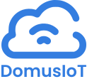

<p align="center">
  
</p>

<p align="center">
  <em>DomusIoT is an open source platform for remote control and scheduling of IoT devices. It offers a user-friendly web interface, real-time MQTT communication, and a scalable architecture.</em>
</p>
<p align="center">
  
  
  
  
  
  
  
  
</p>


---

## ✨ Features

- ⚙️ Register, edit, and remove devices  
- 🔌 Turn devices on and off remotely  
- 💡 Control 110V/220V loads (e.g., lights, relays)  
- 📡 Real-time monitoring via MQTT  
- 🔐 Secure authentication using JWT  
- 🖥️ Web interface built with NextJS and Tailwind CSS  
- 🔧 Firmware for ESP32 using ESP-IDF  

---

## 🧱 Tech Stack

- **Backend:** ☕ Java, 🌱 Spring Boot  
- **Frontend:** ⚛️ NextJS, 🎨 Tailwind CSS  
- **Firmware:** 🛠️ C/C++, ESP32, ESP-IDF  
- **MQTT Broker:** 🛰️ Mosquitto  
- **Infrastructure:** 🐳 Docker  
- **Database:** 🗄️ MySQL  

---

## 🗂️ Project Structure
```text
DomusIoT/
├── backend/ # Java backend (Spring Boot)
├── frontend/ # NextJS project with Tailwind CSS
├── devices/ # ESP32 firmware code (C/C++)
├── infrastructure/ # Docker, Mosquitto config and project startup files
├── docs/ # Technical documentation
├── README.md
└── LICENSE
```

---

## 🚀 Purpose

Provide a general-purpose, extensible, and user-friendly platform for managing IoT devices — reducing dependency on proprietary systems and promoting an open, interoperable ecosystem.

---

## 🏗️ Starting the System

To start the **web system** and the **MQTT broker**, please check the instructions in the [`infrastructure/README.md`](infrastructure/README.md).

For details about our ESP32 project, see the README located at [`devices/domus_01/README.md`](devices/domus_01/README.md).

For details about our **MQTT protocol**, see the README located at [`devices/domus_01/MQTT_PROTOCOL.md`](devices/domus_01/MQTT_PROTOCOL.md).

---

## 🛠️ How to Contribute

1. Fork this repository  
2. Create a new branch: `git checkout -b my-feature`  
3. Commit your changes: `git commit -m 'feat: my new feature'`  
4. Push to your fork: `git push origin my-feature`  
5. Open a Pull Request  

---

## 📜 License

[MIT License](LICENSE)
